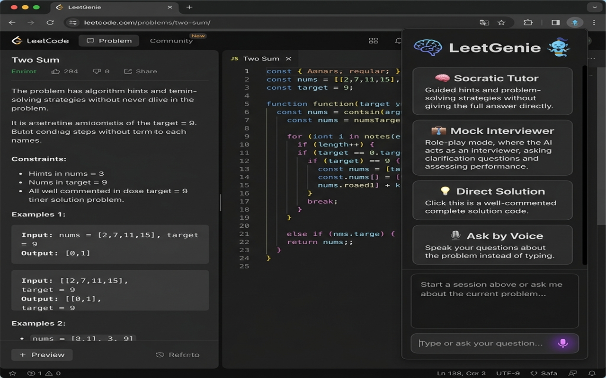
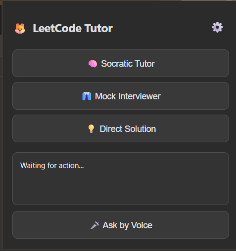
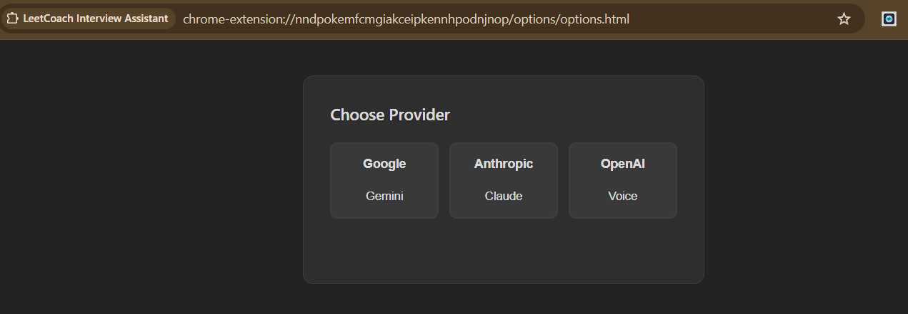
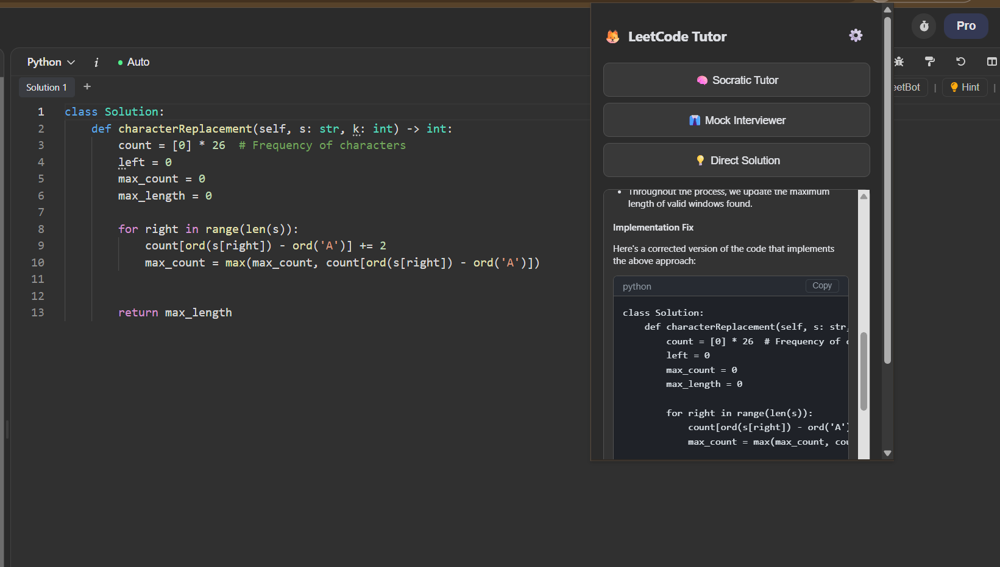

<div align="center">


# LeetCoach — Interview Assistant

### Your personal AI coding coach, right inside LeetCode & NeetCode.

Get Socratic hints, mock-interview feedback, or a full solution for any problem — without ever leaving the page.

<br/>

[](https://chromewebstore.google.com/detail/leetcoach-interview-assis/nndpokemfcmgiakceipkennhpodnjnop)


</div>

---

<!-- SCREENSHOT: Hero shot — the extension popup open on the right, a LeetCode problem page behind it. Ideally show an AI response with a code block visible. (assets/screenshot_1280x800.png can be reused here) -->
<p align="center">
  
</p>

---

## 💡 Why I built this

Most LeetCode "helper" tools just hand you the answer — which is the *worst* way to prepare for a real interview. **LeetCoach** is built around how people actually learn to solve problems: it can nudge you with a single hint, grill you like a real interviewer, or explain the optimal solution with complexity analysis when you're ready to study it.

It reads the problem and your in-editor code straight from the page, sends it to the AI provider **you** choose, and renders a clean, formatted answer — code blocks, copy buttons, and all. There's even a **voice mode** so you can talk through a problem out loud, exactly like a live interview.

## ✨ Features

| | Mode | What it does |
|---|------|--------------|
| 🧠 | **Socratic Tutor** | Gives you *one* hint at a time — never the whole answer. Hit **"Next Hint"** to progress step by step until it clicks. |
| 👔 | **Mock Interviewer** | Reviews your current code like a strict-but-fair interviewer: correctness, efficiency, and style. Supports follow-ups. |
| 💡 | **Direct Solution** | Explains the optimal approach with a clean code implementation and **time/space complexity** analysis. |
| 🎤 | **Ask by Voice** | Record a spoken question, get a spoken answer back — powered by Whisper (speech-to-text) and OpenAI TTS. |

**Plus:**

- 🔌 **Bring your own provider** — works with **Google Gemini**, **Anthropic Claude**, or **OpenAI**. You pick.
- 🌐 **Works on LeetCode & NeetCode** problem pages out of the box.
- 📋 **Formatted responses** with syntax-aware code blocks and one-click copy.
- 🔊 **Spoken answers** — responses are read aloud automatically when an OpenAI key is set.
- 🌙 **Light & dark mode** that follows your system theme.
- 🔐 **Privacy-first** — your API key lives only in your browser and calls go *directly* to the provider. No middleman server.

## 🎬 How it works

> Add your API key once → open any problem → click a button → get your answer.

<!-- SCREENSHOT: The popup UI showing the four mode buttons (Socratic Tutor, Next Hint, Mock Interviewer, Direct Solution) and the "Ask by Voice" button. -->
<p align="center">
  
</p>
<p align="center"><em>The popup — one click per mode.</em></p>

<br/>

<!-- SCREENSHOT: The Settings/Options page showing the provider chooser (Google Gemini / Anthropic Claude / OpenAI) and the API key input. -->
<p align="center">
  
</p>
<p align="center"><em>Settings — choose your provider and paste your key.</em></p>

<br/>

<!-- SCREENSHOT: An example AI response rendered in the popup, ideally with a code block + the "Copy" button visible. -->
<p align="center">
  
</p>
<p align="center"><em>Clean, formatted answers — copy code with one click.</em></p>

## 🚀 Getting started

### Option 1 — Install from the Chrome Web Store (recommended)

**[→ Add LeetCoach to Chrome](https://chromewebstore.google.com/detail/leetcoach-interview-assis/nndpokemfcmgiakceipkennhpodnjnop)**

### Option 2 — Load unpacked (for development)

1. Clone the repo: `git clone https://github.com/Xonesix/leetcode-tutor-extension.git`
2. Open `chrome://extensions` in Chrome.
3. Toggle **Developer mode** on (top-right).
4. Click **Load unpacked** and select the project folder.

### Set up your API key

1. Click the LeetCoach icon, then the **⚙️ settings** gear.
2. Choose a provider and paste your key:

   | Provider | Get a key |
   |----------|-----------|
   | **Google Gemini** | [Google AI Studio](https://aistudio.google.com/app/apikey) |
   | **Anthropic Claude** | [Anthropic Console](https://console.anthropic.com/) |
   | **OpenAI** (required for voice) | [OpenAI Platform](https://platform.openai.com/api-keys) |

3. Hit **Save**, open any LeetCode or NeetCode problem, and click a mode. That's it. 🎉

## 🛠️ Tech & architecture

Built as a lightweight **Chrome Manifest V3** extension in **vanilla JavaScript** — no frameworks, no build step.

```
┌─────────────┐   START_INTERVIEW    ┌──────────────┐
│   popup.js  │ ───────────────────► │  content.js  │  scrapes title, difficulty,
│  (the UI)   │ ◄─────────────────── │ (in the page)│  description & your code
└──────┬──────┘     scraped data     └──────────────┘
       │
       │ CALL_AI (problem + mode + question)
       ▼
┌──────────────┐    HTTPS    ┌─────────────────────────────┐
│ background.js│ ──────────► │  Gemini / Claude / OpenAI   │
│(service worker)            └─────────────────────────────┘
└──────────────┘
```

- **`content/content.js`** — injected on problem pages; scrapes the question and your editor code from the DOM (handles both LeetCode and NeetCode layouts).
- **`popup/`** — the popup UI, markdown-ish response formatter, copy-to-clipboard, and the voice (mic → Whisper → AI → TTS) pipeline.
- **`background.js`** — service worker that routes each request to the selected provider with a mode-specific system prompt.
- **`options/`** — provider picker and API-key storage (`chrome.storage.sync`).

**Highlights for the curious:**
- Separate, carefully-tuned **system prompts** per mode (tutor gives *one* hint; interviewer stays critical; solution adds complexity analysis).
- A custom lightweight **markdown renderer** that safely escapes HTML and turns ` ``` ` blocks into copyable code cards.
- End-to-end **voice loop**: `MediaRecorder` → OpenAI Whisper transcription → AI answer → OpenAI TTS playback.

## 🔒 Privacy

LeetCoach has no backend. Your API key is stored locally via `chrome.storage.sync` and every request goes **directly** from your browser to the AI provider you chose. The extension only reads page data on `leetcode.com` and `neetcode.io` problem pages.

## 📄 License

MIT — free to use, learn from, and build on.

<div align="center">
<br/>
<sub>Built with ☕ to make interview prep actually stick.</sub>
</div>
